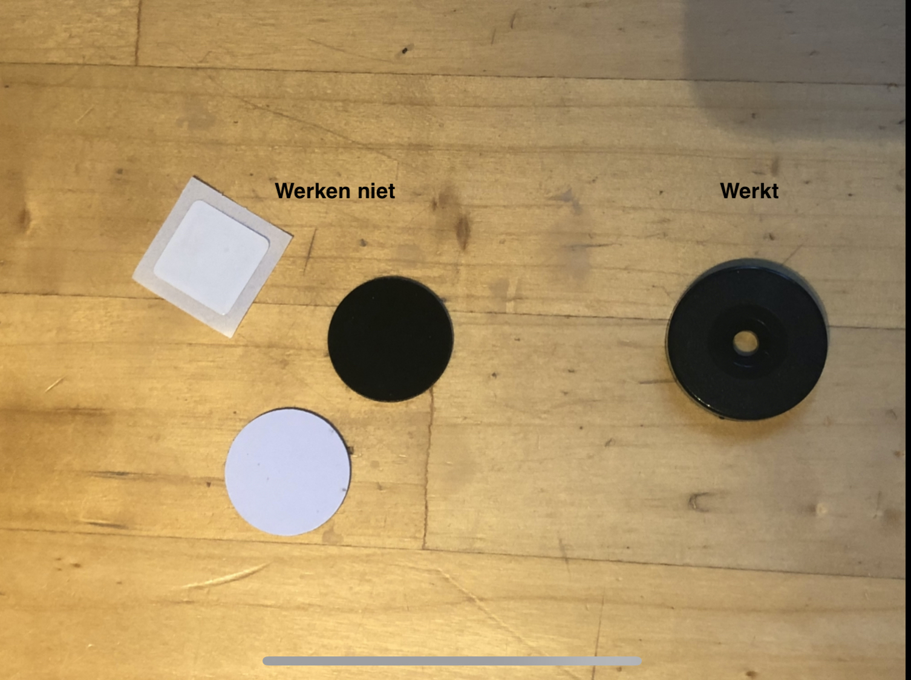
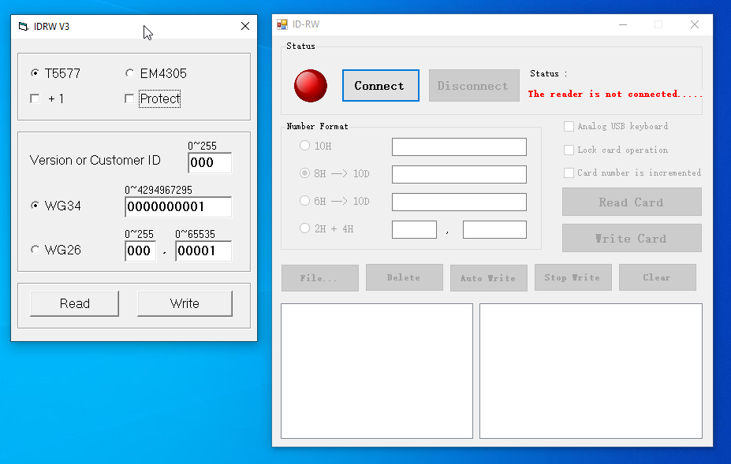
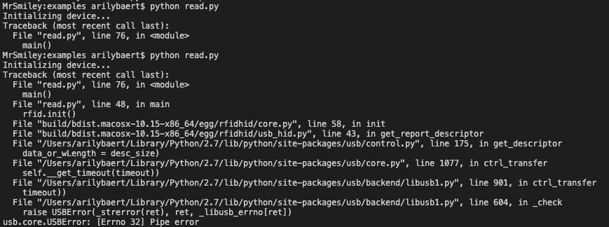

# RFID (Radio Frequency Identification)
Inleiding:
Deze technologie maakt gebruik van elektromagnetische velden om bepaalde objecten te identificeren of traceren. De RFID-tag is eigenlijk een klein radiotoestel. Het heeft een radio-ontvanger en uitzender.    

Je kan de tag dus uitlezen door met een RFID-Lezer in de buurt te komen. De Tag zendt dan een digitaal signaal terug, meestal een identificatienummer.

Je hebt 2 soorten tags:
1.	Passieve: Deze worden aangedreven door de energy die uitgezonden wordt door de lezer
2.	Actieve: Deze worden aangedreven door een eigen batterij. Hierdoor kan hij vanop een grotere afstand uitgelezen worden.

Toepassingen:
* Industrie: Er wordt een chip op wagen plaatst zodat ze tijdens het productieproces de vooruitgang van al hun wagens kunnen nagaan.
 
* Retail: In winkels als bijvoorbeeld Decathlon plakken er tags op merendeel van hun producten. Als je daar aan de zelfscan komt gooi je al u producten in een bak en kan je onmiddellijk afrekenen.

* Inplanten: Ze worden ook al ingeplant in dieren of mensen. Deze tag hebben de grootte van een korrel rijst.

## Verkeer
In 2014 zijn ze al begonnen met het implementeren van een elektronisch tol-systeem om zo op een praktischere manier te kunnen betalen vanuit een voertuig. Men gaat elk voertuig voorzien van een kleine sticker met een passieve RFID-tag. Een tag die dus niet moet gekoppeld worden aan een stroombron.

Men is begonnen met het ontwikkelen van RFID-tags in het verkeer om zo het proces van tol te betalen onderweg te versimpelen. Meet de bedoeling om files te vermijden. Mensen die al eens de autostrade in Frankrijk genomen hebben zullen de bottleneck die pages veroorzaken zeker al eens gevoeld hebben. Het automatiseren via een dergelijk systeem kan de betaling aan pages versnellen met 3 à 4 seconden per voertuig.

Eenmaal een voertuig aan een uitgerust tol=station aankomt moet ze gewoon vertragen zodat de scanner de voorruit (voorzien van een tag) uitgelezen kan worden. Hiermee identificeren ze het voertuig en kijken ze of het gekoppeld is aan een betaal account. Ze verrekenen de kosten en zo kan het voertuig doorrijden. Mensen kunnen hun account gemakkelijk herlanden m.b.v. debit-credit kaarten, overschrijvingen, ect. 

## Corona

De huidige pandemie waarin we ons bevinden is voor vele een nieuwe en angstaanjagend gegeven. De situatie geeft ons een andere kijk op het leven met als gevolg dat vele gewoontes en gebruik aangepast worden. Vele geven elkaar geen hand of zoen meer, opstappen gebeurt nu achteraan in bus, ect. RFID-technologie kan op sommige van deze gebieden (denk aan de bevooradingsketen of op in de medische sector) soelaas bieden.

Om inzicht te krijgen in het verbeteren van veiligheidsvoorschriften kan het handig zijn om bepaalde producten of mensen op te volgen (al dan niet realtime). Door het noviteit en bereik van het virus zijn vele ziekenhuizen onderbemand en staat hun personeel onder ongezien druk. Hier kan RFID-technologie vanpas komen. 

Op de volgende manieren:
* Fysiek contact met materiaal verminderen
Je kan op een simpele manier bepaalde materialen uitlezen zonder ze te hoeven aan te raken. Bij een barcode lezer moet je elk item afzonderlijk scannen. Bij RFID moet het gewoon in de buurt bevinden en je eb alles in een beweging uitgelezen.

* Zichtbaarheid van materiaal:
Het implementeren van tag is steriel materiaal zorgt ervoor dat je op een gemakkelijke manier alles kan lokaliseren. Dit minimaliseert het tijdsverlies.

* Verzekerde ontsmetting van materiaal:
Door elk apparaat te voorzien van een eigen tag kan je gemakkelijk de ontsmetting procedures van het materiaal opvolgen. Op die manier kan je dan indien nodig extra ontsmettingsmomenten voorzien of het materiaal wegwerpen.

* Stockbeheer:
Gedurende een pandemie kan het van uitermate belang zijn om de voorraad van goederen in realtime bij te houden. Zo kunnen medewerkers extra bestellingen doorgeven waar nodig. Dit kan allemaal heel gemakkelijk met RFID

Zelfs buiten de medische sector kan RFID helpen de verspreiding van het virus verminderen. Door getransporteerde goederen op een geautomatiseerde manier op zoveel mogelijk plaatsten scannen kan men nagaan waar de goederen zich allemaal bevonden hebben en wie ermee in contact is geweest en hoe vaak. De technologie laat ook toe dat men goederen niet eens moet aanraken om te te scannen, dit voorkomt dat mensen de goederen kunnen besmetten.

* Handwas routine:
Binnen de medische sector is goede handhygiëne heel belangrijk. Dit is niet enkel voor corona. Wat mijn in feite kan dien is aan de kraan een lezer te plaatsen die elke badge van passeren medewerkers uitleest om zo na te kan wanneer en hoe vaak personeel hun handen wast.

## Project toepassing

Afgelopen week ben ik op zoek gegaan hoe ik mijn ideeën kan omzetten tot een werkende toepassing. Ik ben begonnen met te kijken hoe ik de RFID-chips zou uitlezen of overschrijven. Gezien ik een Windows lezer heb gekregen heb ik via VirtualBox Windows 10 geïnstalleerd

VirtualBox: https://www.virtualbox.org/wiki/Downloads
Windows 10: https://www.microsoft.com/en-us/software-download/windows10ISO

Eenmaal je de lezer via usb aansluit begint Windows automatisch de bijhorende drivers te installeren en kan je RFID-chips uitlezen. Het enigste dat je hiervoor moet doen is notepad, word, of andere teksteditor openen je muis actief zetten en de tag op de lezer leggen. 

Format: 

Het enige probleem dat ik ben tegen gekomen is dat ik enkel deze twee tags kan uitlezen. Ik vermoed dat de andere tags werken via protocollen die niet compatibel zijn met de lezer. De kleintjes zijn NFC-tags. Deze kan ik zonder probleem lezen en bewerken met mijn iPhone en de eerste app die ik kon vinden in de appstore.

Format: 

Voor nieuwe data te schrijven naar de tags is het een heel ander verhaal. Software voor het overschrijven van tags is helemaal niet zo veelvoorkomend als ik initieel had verwacht. De programma’s die ik tegenkom lijken allemaal te dateren uit de jaren stillekes. Bovendien ben ik er niet in geslaagd het werkend te krijgen.

Als ik opzoek ga naar de bijhorende software voor dit specifiek apparaat kom ik uit op sites als Aliexpress met een shady download link waar de licentiesleutel van de software en de software samen in een zip wordt gegeven. 

Aliexpress product: https://nl.aliexpress.com/item/32721839667.html?spm=a2g0z.12010612.8148356.5.102d217cTDxqOp
shady downloadlink 1: http://download.5yoa.com/IDW02.zip
shady downloadlink 2: http://www.jedreksys.com/download/IDRW-V3-T5577-Write-Read-Software.html

Uiteindelijk ben ik op een github repository gekomen van iemand die er zijn werk van heeft gemaakt “reverse engineering” toegepast om de software die geschreven is voor een Windows om te zetten naar een python script om het apparaat werkend te krijgen op Mac OSX en Linux. Voor de geïnteresseerden, hij heeft heel het proces op zijn wiki gezet. 

Repository: https://github.com/charlysan/pyrfidhid

Format: 

Het zag er allemaal veel belovend uit. Ik heb zijn repository gecloned en zoals vermeld in de readme.md de product_id en vendor_id aangepast naar die van mijn specifiek apparaat. Maar telkens ik het read.py script uitvoer krijg ik een foutmelding. Nochtans de foto’s van zijn apparaat lijken sprekend op die dat ik heb. Maar achteraf bekeken blijkt deze op 13mhz te werken en die van hem op 125khz waardoor de software niet geoptimaliseerd is voor mijn apparaat.

